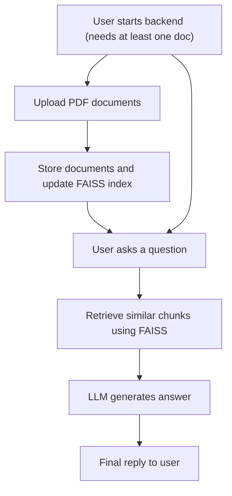

# CHATBOT WITH RAG + LLM

## Description

A python project that allows question-answering over documents using a combination of retrieval-augmented generation (RAG) 
and large language models (LLM). This system supports PDF documents, vector embeddings, and flexible LLMs from Hugging Face.

## Features

  * Ingest PDF documents and split them into chunks.
  * Compute embeddings using pre-trained model (sentence-transformers).
  * Store and retrieve vectors efficiently with FAISS.
  * Generate answer with a configurable LLM using context from retrieved document chunks.
  * Fully configurable via environment variables (.env).
  * Logs operations and errors for easier debugging.

## Project structure

```
chatbot/
├─ app/      
    ├─ backend/  #  API endpoints and pydantic models
    ├─ frontend/  # web interface
        ├─ js/ # interface logic and communication with the backend                
        ├─ css/ # styling and responsive design
├─ core/  # all components of the Chatbot                 
├─ data/   
    ├─ documents/ # storaged of docs                
    ├─ faiss_index/ # storaged of indexs
├─ tests/ # unit test for each file in core
├─ .env   
├─ README.md
├─ requirements.txt
```

## Project diagram



## Installation

### 1. Clone the repository

```
git clone https://github.com/tene04/chatbot.git
cd chatbot
```

### 2. Install dependencies

```
pip install -r requirements.txt
```

### 3. Set up environmental variables

This is an example of what would be the .env:
```
# GENERAL CONFIGURATION
DEVICE="cpu"
DOCUMENTS_PATH="./data/documents"
FAISS_INDEX_PATH="./data/faiss_index"
TOP_K=5

# PDF_PROCESSING CONFIGURATION
PDF_PROCESS_MAX_WORDS=200

# EMBEDDING CONFIGURATION
EMB_MODEL_NAME="sentence-transformers/all-MiniLM-L6-v2"

# RAG CONFIGURATION
RAG_CHUNK_SIZE=400
RAG_FORCE_REBUILD=false
RAG_THRESHOLD=0.2
RAG_MAX_TOKENS=500

# LLM CONFIGURATION
LLM_STOP_SEQUENCES=["<|endoftext|>", "###", "Human:", "Assistant:"]
LLM_MODEL_NAME="gpt2"
LLM_LOAD_IN_4BIT=false
LLM_TORCH_DTYPE="float32"
LLM_MAX_NEW_TOKENS=150  
LLM_TEMPERATURE=0.2
LLM_TOP_P=0.9
LLM_TOP_K=50
LLM_REPETITION_PENALTY=1.1
LLM_STREAM=false
```

## Usage

### Start the backend

```
python -m app.backend.API
```

### Open the web interface

```
http://localhost:8000/index.html
```

After this you will see a web interface where you can:
  * Upload PDF documents by selecting or dragging.
  * Ask questions in the chat box.
  * Get answers retrieved from your documents.

## Environment variables

### General configuration

  * DEVICE: Defines the device where models will run.
  * DOCUMENTS_PATH: Folder where uploaded documents are stored.
  * FAISS_INDEX_PATH: Folder where the FAISS index is stored.
  * TOP_K: Number of top relevant chunks retrieved for each query.

### PDF processing configuration

  * PDF_PROCESS_MAX_WORDS: maximum number of words per chunk when processing PDFs

### Embedding configuration

  * EMB_MODEL_NAME: Embedding model used to convert text into vector representations.

### RAG configuration

  * RAG_CHUNK_SIZE: Size of each text chunk in tokens/words when buildin FAISS index.
  * RAG_FORCE_REBUILD: Wether or not rebuilt the FAISS index.
  * RAG_THRESHOLD: Minimun similarity threshold to consider a document relevant.
  * RAG_MAX_TOKENS: maximum number of tokens from retrieved documents that can be passed to the LLM.

### LLM configuration

  * LLM_STOP_SEQUENCES: Sequences where the LLM should stop generating.
  * LLM_MODEL_NAME: Language model used to generate response.
  * LLM_LOAD_IN4BIT: Wether or not to load the models in 4-bit precision in order to save memory but reducing quality.
  * LLM_TORCH_DTYPE: PyTorch data type for loading the model.
  * LLM_MAX_NEW_TOKENS: maximum number of tokens the LLM can generate as an output.
  * LLM_TEMPERATURE: Controls randomness of response.
  * LLM_TOP_P: Nucleus sampling, probability mass cutoff for candidate tokens.
  * LLM_TOP_K: maximum number of candidate tokens considered at each step.
  * LLM_REPETITION_PENALTY: Penalizes repeated tokens in the output.
  * LLM_STREAM: Wether or not the responses are streamed token by token indead of returned at once.


